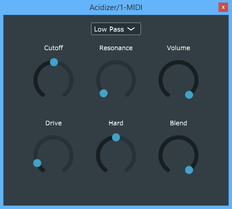

# Acidizer

Acidizer is an open-source and free audio plugin using the JUCE Framework. Its goal is to acidize synths sounds but it can actually be used for anything you want to. It is composed of a variable state filter, you can choose either a low-pass, band-pass, high-pass or no filter at all, and a distortion module.
I made it for personnal entertainment so it is probably not going to evolve much for now. 

## JUCE Framework
This plugin was built using the C++ JUCE Framework. For more information check both their website and github : 
https://juce.com/ 
https://github.com/WeAreROLI/JUCE/tree/af041a02d764e3120865664f5e4b8134914c2dd6 
It has native build methods for VST3, AU, AUv3, RTAS, AAX and Unity.  
If you want to build the plugin by yourself, simply open the __.jucer__ file with Projucer and set your builds and IDE configuration.

## Acidizer Plugin
### Principle
The plugin make the sounds first pass trough a 2nd order __filter__, with configurable type, cutoff and frequency. It uses the JUCE class `dsp::StateVariableFilter::Filter`. When selecting the *No filter* option, the filter simply stop processing on the audio buffer and leave it unchanged.   
Then the sounds pass through a __distortion__ module, with three configurable parameters :
 - __Drive__ : Set the input gain applied before clipping
 - __Hard__ : Set the proportion between soft clipping ( *( 2 / pi \*atan(x) ) ^ 1.5* ) and hard clipping ( *( 2 / pi \*atan(x) ) ^ 0.5* )
 - __Blend__ : Set the proportion between distorded signal and undistorded signal (which already passed through the filter)
  
### UI
The plugin is composed of six knobs and a filter type selection menu. The name of each knobs indicate what parameter (see above) it controls. The *Volume* one simply controls the final volume of the signal after processing. 

### Download
Here is a link to download the VST2 and VST3 builds of the Acidizer. Be aware it might not be the latest build.
LATEST UPLOAD : 23/01/2019
https://www.mediafire.com/file/ahi4f6ed8fbh8kc/AcidizerVST.rar/file

## Notes
Most of the range of the parameter were set while experimenting with the plugin to make the sounds __I like__. I'm also pretty new to these frameworks and techs, so don't hesitate to give feedback !
And if ever you'd like to know what kind of sounds I like here is my soundcloud : 
https://soundcloud.com/user-155802894-310997774
